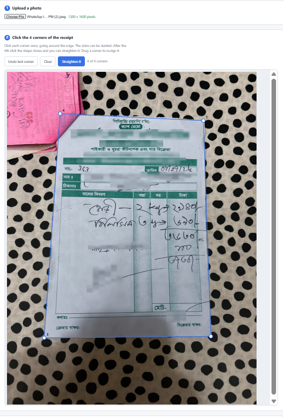
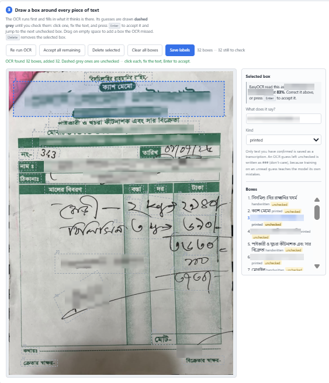

# Annotator

A small web app for marking up the text in receipts, forms and documents.

Upload a photo, click the four corners to flatten the page, and OCR fills in a
first draft of every piece of text it finds. You correct what it got wrong and
add what it missed. Only the text you confirm is exported, so an unchecked
guess never ends up in your labels.

Works with any language [EasyOCR](https://github.com/JaidedAI/EasyOCR)
supports, printed or handwritten.

## Install

```bash
git clone https://github.com/k-byzid/Annotator-Tool.git
cd Annotator-Tool

python -m venv .venv
source .venv/bin/activate        # Windows: .venv\Scripts\activate

pip install -r requirements.txt
```

## Run

```bash
python -m annotator
```

Then open <http://127.0.0.1:5000>.

```bash
python -m annotator --lang en fr      # OCR languages (default: en)
python -m annotator --network         # also reach it from a phone or tablet
python -m annotator --port 8000
```

The first OCR run downloads the EasyOCR models, which takes a minute. After
that it is cached.

## How it works

**1 & 2 — upload a photo and click the four corners.** The sides can be
slanted; the app flattens the quadrilateral into an upright page.



**3 — check the text.** OCR runs automatically and draws what it found. Its
guesses are **dashed grey** until you check them: click a box, fix the text,
and press <kbd>Enter</kbd> to accept it and jump to the next unchecked one.
Drag on empty space to add a box the OCR missed.



## What it saves

Everything goes under `data/`, one set of files per page:

- `data/labels/<name>.json` — every box, its text, and whether you confirmed
  it. This is the file worth keeping.
- `data/export/gt_<name>.txt` — the same boxes in ICDAR-2015 format, which
  text-detector trainers read. Text you have not confirmed is written as
  `###`, the standard don't-care marker.

Set `ANNOTATOR_DATA` to put that somewhere else.

## Tests

```bash
pip install pytest
pytest
```

## Licence

MIT — see [LICENSE](LICENSE).
